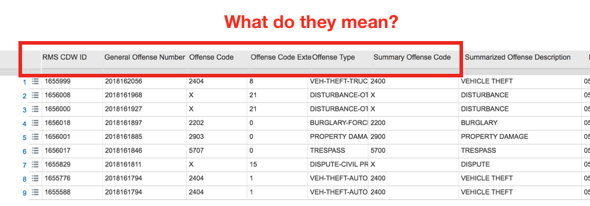

# Project Description  
## General Information  

**Seattle Police Department Police Report Incident**, retrieved from [City of Seattle Open Data Portal](https://dev.socrata.com/foundry/data.seattle.gov/y7pv-r3kh), is the dataset our group chose to work with. This dataset contains details about incidents in Seattle according to the police reports filed by responding officers. The information for a particular incident is published to the dataset 6-12 hours after the corresponding police report is filed. The dataset contains *over 1,000,000 rows spanning 1990 to 2018*. However, the system for publishing data was adopted by the Seattle Police in 2010, and all records prior to 2010 are only added if the incident is revisited. This means that the vast majority of the data is from *2010-2018*.

## Audience

For a crime report based on a particular area, almost everyone living near the area is likely to be concerned with safety and will, therefore, find the report relevant. We have decided to focus on incidents in and around the **UW campus**. Though the report will be useful to anyone in this area, we will look to serve **students** in particular. Our goal is to present insights from the data and thereby provide our audience with a better sense of how to live safely.  

Hence, the specific questions our project will answer for our audience are as following:        

* What is the frequency of incidents based on type?     
* Is there any location that is particularly dangerous? What type of incident occurred the most in this given location?   
* Which times of day are the safest? Which are most dangerous? Is there a correlation between time of day and the types of crime committed?    
* Is the safety around UW campus trending up or down?  

# Technical Description

To access the data, our group will be using the "RSocrata" library. Since the data we read in is not organized in the most efficient way, we will perform different types of data-wrangling methods to sort the data first. Some basic steps are described below:

* **Filter** down the data as we want to focus on the area near/on UW Seattle campus.
* **Grouping** the data by date, location, incident types, time and other categories to summarize some essential information we would like to use.   
* **Reformating** the overall dataset
    + Selecting relevant columns because we may not need attributes like "RMS CDW ID" and others that aren't useful to us.
    + Mutating columns to convert dates to a different representation to present the data in a more accessible way.  

## Libraries of Choice

Besides using the "RSocrata" library to interact with our dataset, some other libraries that we'll be using for this project are "ggthemes", "kableExtra" and "lubridate".

## Major Challenges

Throughout the process of our final project, we anticipate some challenges. Sorting data is the goal we will spend a lot of time working on because there are more than 1,000,000 rows. We not only have to figure out how to best present the data, but we also need to **make sense of the variables** used in the dataset.

## Additional Statistical Analysis

To have a more comprehensive visualization, we are interested in asking some other questions below:    

* What is the average number of cases for each year? For each month?
* What is the crime rate for each offense type?
* What is the probability of being involved in an incident at a given location?
