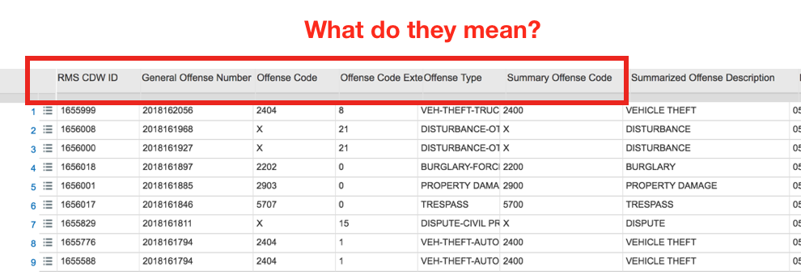

```{r setup, include=FALSE, echo = FALSE}
library("knitr")
```

```{r link, echo = FALSE}
link_markdown_Seattlegov <- paste0("[City of Seattle Open Data portal](", "https://dev.socrata.com/foundry/data.seattle.gov/y7pv-r3kh", ")")
```

### <span style="color:darkblue">Project Description</span>

#### General Information  

*Seattle Police Department Police Report Incident*, retrieved from `r link_markdown_Seattlegov`, is the dataset our group chose to work with. This dataset contains details about criminal incidents occurred within Seattle, and was recorded by responding officers’ initial police reports. The information was transmitted to data.seattle.gov after the incidents were filed into the system. The data we extracted for our group project consists *at least 1,000,000 rows from 1997 to 2018*.

#### Audience

For a crime report based on a particular area, almost everyone living within the area or whoever is interested in learning the safety issue of the area is likely to be concerned and find relevance. However, our group have decided to <span style="color:red">**focus on students near UW campus**</span>. In all, our goal in visualizing the chosen data is to provide our audience, namely the students, a better sense of their safety in Seattle.   

Hence, the specific questions our project will answer for our audience are as following:    

* What is the frequency of incidents based on types?    
* Is there any location that is particularly dangerous to go? what type of incident occurred the most in this given location?   
* When is the time that offenders are more likely to commit a crime? Daytime or Midnight? Will the situation vary if the type of crime is different?    
* Has the safety around UW campus declined or inclined?

### <span style="color:darkblue">Technical Description</span>

To access the data, our group will be using the “RSocrata” library. Since the data we read in is not organized in the most efficient way, we will perform different types of data-wrangling methods to sort the data first. Some basic steps are discribed below: 

* **Filter** down the data as we want to focus on the area near/on UW Seattle campus.
* **Grouping** the data by year, location, incident types, time and other categories to summarize some essential information we would like to use.   
* **Reformating** the overall dataset 
    + Selecting columns because we want to drop columns like “RMS CDW ID” and others that aren’t useful to us.
    + Mutating columns to convert dates to a different representation in order to analyze the data in a more convinent way.   
* 

#### Library of Choice

Besides using the “RSocrata” library to interact with our dataset, some other libraries that we’ll be using for this project are “ggthemes”, “kableExtra” and “lubridate”. 

#### Major Challenges

Throughout the process of our final project, we anticipate some challenges. <span style="color:red">Sorting data</span> is definitely something we will spend a lot of time working on because there are more than 1,000,000 rows. We not only have to figure out which rows and columns we want to analyze or disregard but also need to making sense of the variables used in the dataset. 



#### Additional Statistical Analysis

To have a more conprehensive visualization, we are interested in asking some other questions below:    

* What is the average number of cases for each year?
* What is the crime rate near/on UW campus?
* Distribution: What is the probability of being robbed on a given location?
